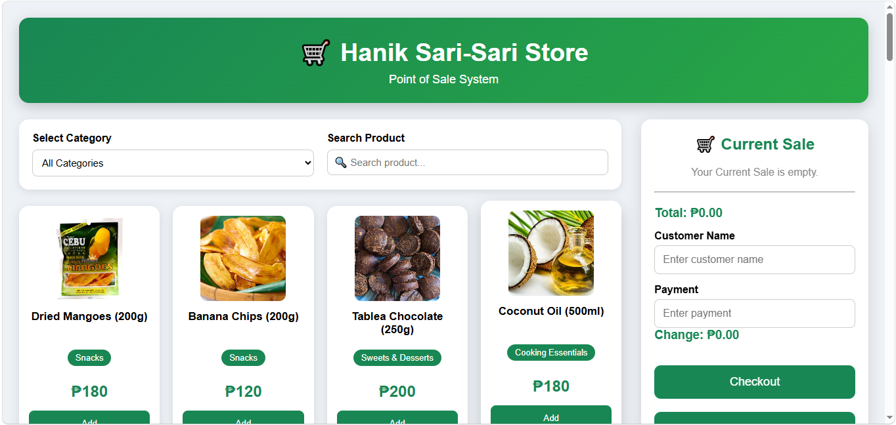
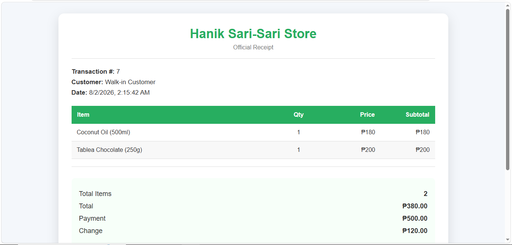
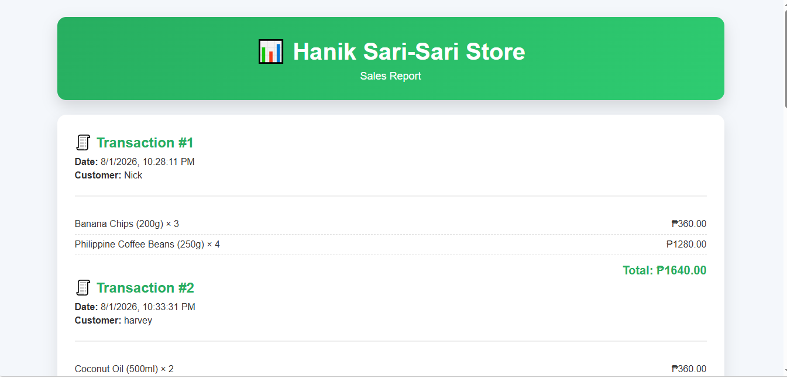

# 🛒 Hanik Sari-Sari Store POS System

A simple **Point of Sale (POS) System** built using **HTML, CSS, and JavaScript**. The project simulates a traditional sari-sari store cashier system where products can be selected, quantities managed, payments processed, receipts generated, and sales reports viewed.

---

## 📸 Screenshots

### Main POS Interface





### Receipt





### Sales Report





---

# ✨ Features

## 🛍 Product Catalog

- 50 Philippine-made grocery products
- Product images
- Category filtering
- Product search bar
- Responsive product grid

---

## 🧾 Current Sale

Instead of using a shopping cart, the system follows a traditional POS workflow by maintaining a **Current Sale**.

Features include:

- Add products
- Increase quantity
- Decrease quantity
- Remove products
- Automatic subtotal calculation
- Running total

---

## 💳 Checkout

- Customer name input
- Payment input
- Automatic change calculation
- Prevents insufficient payment
- Saves completed transaction

---

## 🧾 Receipt

After checkout, the system automatically generates a printable receipt containing:

- Store Name
- Transaction ID
- Customer Name
- Date & Time
- Purchased Items
- Quantity
- Price
- Subtotal
- Total
- Payment
- Change

---

## 📊 Sales Report

The report page displays:

- All transactions
- Transaction date
- Purchased products
- Total per transaction
- Total sales
- Most purchased product

---

## 🔍 Search Feature

Search products instantly by typing part of the product name.

Example:

```
man
```

Returns:

- Mango Jam
- Dried Mangoes
- Mangoes

---

## 📂 Product Categories

Products can be filtered by category.

Example:

- Snacks
- Beverages
- Bakery
- Fresh Fruits
- Seafood
- Meat & Poultry
- Vegetables
- Dairy & Eggs
- Cooking Essentials
- Rice & Grains
- Condiments & Seasonings
- Instant Foods
- Sweets & Desserts

---

# 🛠 Technologies Used

- HTML5
- CSS3
- JavaScript (ES6)
- Local Storage

---

# 📁 Project Structure

```
Hanik-Sari-Sari-Store/
│
├── images/
│
├── Design/
│   ├── style.css
│   ├── receipt.css
│   └── report.css
│
├── Function/
│   ├── script.js
│   ├── receipt.js
│   └── report.js
│
├── index.html
├── receipt.html
├── report.html
└── README.md
```

---

---

# 💻 System Workflow

```
Select Product
        │
        ▼
Current Sale
        │
        ▼
Adjust Quantity
        │
        ▼
Enter Customer Name
        │
        ▼
Enter Payment
        │
        ▼
Checkout
        │
        ▼
Receipt
        │
        ▼
Sales Report
```

---

# 📚 Learning Objectives

This project demonstrates:

- Arrays
- Objects
- Array Methods
- filter()
- find()
- forEach()
- Event Listeners
- DOM Manipulation
- Local Storage
- Responsive Web Design
- JavaScript Functions
- POS Transaction Logic

---

# 👨‍💻 Author

**Nick Charles Durangparang Clarito**

BS Information Technology

---

# 📄 License

This project is for educational purposes only.
